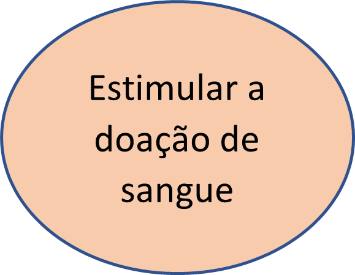
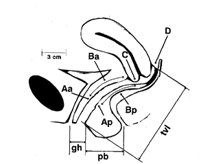
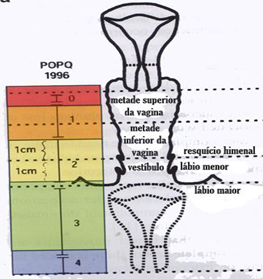
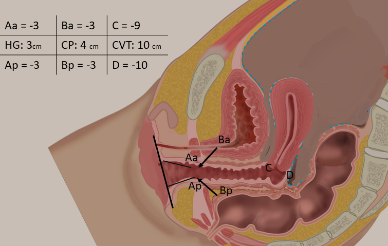

### **Via de acesso ao ambulatório**

-   Via SISREG ou SER (03 vagas); ou

-   Via encaminhamento interno de mulheres já atendidas por outras clínicas no HUPE ou PPC.

### **Perfil do paciente**

-   Prolapso genital;

-   Incontinência urinária associada a prolapso;

-   Infecções urinárias de repetição;

-   Dor pélvica crônica associada a sintomas urinários ou prolapsos; e

-   Fístula vesico-vaginal.

\newpage

### **Atendimento da paciente no Ambulatório Primeira consulta**

As pacientes devem ser inseridas no banco de dados criado para o ambulatório (Projeto prolapso), através do endereço do REDCap via web: [www.redcap.lampada.uerj.br](https://redcap.lampada.uerj.br). Todos os itens abaixo devem ser preenchidos na primeira consulta:

-   Cadastro;

-   Anamnese;

-   Exame físico;

-   Tratamento proposto; e

-   Questionários de autopreenchimento (são entregues às pacientes pela recepcionista e preenchidas antes da consulta):

    -   Questionário de impacto no assoalho pélvico (PFIQ-7);

    -   Questionário de incontinência urinária (ICIQ-SF); e

    -   Questionário de qualidade do sono.

Após inserir todos as informações no banco de dados, preencher o prontuário eletrônico (MV) com as informações importantes da consulta (lembrar que nem todos terão acesso ao REDCap, pois este é apenas para fins de pesquisa):

Anamnese;

-   HPP;

-   HGO;

-   Exame físico; e

-   Tratamento proposto.

#### **Pacientes com indicação cirúrgica**

-   Solicitar exames pré-operatórios;

-   Inserir na fila de cirurgias do serviço (*Google forms*);

-   Explicar para a paciente os detalhes da cirurgia indicada e **entregar o consentimento informado** (a paciente deve levar para casa preenchido e assinado pelo médico, em duas vias, e trazer no dia da internação assinado).

{width="221" height="123"}

#### **Durante a internação cirúrgica**

Verificar **se assinou o consentimento informado** (entregue durante a consulta do ambulatório) e anexar ao prontuário;

Pacientes submetidas a cirurgia (preencher no [REDCap](https://redcap.lampada.uerj.br)):

-   Formulário "Pós-operatório" (deve ser preenchido após a cirurgia e ainda durante a internação);

-   Preencher *Google forms* de cirurgias do serviço e dar baixa na planilha da fila de cirurgias.

### **Revisão cirúrgica**

-   Primeira revisão entre 20 e 30 dias (casos excepcionais devem ser avaliados individualmente);

-   Verificar laudo histopatológico;

-   Orientar a pegar laudo histopatológico (se aplicável) 30 dias após a cirurgia;

-   Revisão da cirurgia (preencher no REDCap e MV): devem ser preenchidas em 6, 12 e 24 meses após a cirurgia todas as informações abaixo:

    -   Formulário no REDCap de Revisão da cirurgia; e

    -   Reaplicar os questionários:

        1.  de impacto no assoalho pélvico (PFIQ-7);

        2.  de incontinência urinária (ICIQ-SF); e

        3.  de qualidade do sono.

### **Revisão clínica**

-   Reavaliar tratamento de acordo com a doença;

-   Caso seja indicada cirurgia, verificar se tem cadastro no REDCap. Caso positivo, atualizar dados; se negativo, inserir no banco como novo cadastro.

### **Exame físico**

Queixas de incontinência urinária de esforço - fazer o teste da tosse em com a paciente em pé e com a bexiga "confortavelmente" cheia (avaliar a perda em até três tosses);

Avaliação de pacientes com prolapso:

-   Preferencialmente deitada, porém se não for evidenciado o prolapso, deve ser feito o exame a paciente em pé;

-   Utilizar o **POP-Q**

    -   Medir primeiro**: hiato genital e corpo perineal**;

    -   A seguir, os pontos **Aa,Ba,C, Ap, Bp,e D** (se aplicável) com a paciente realizando manobra de valsava; e

    -   Por fim, reduzir o prolapso e medir o **comprimento total da vagina**.

### **POP-Q**

Os prolapsos serão classificados de acordo com o *Pelvic Organ Quantification System* (POP-Q), sistema padronizado adotado pelos membros da ICS, *American Urogynecology Society* (AUGUS) e da *Society of Gynecologic Surgeons* (SGS).[@Madhu2018; @Bump1996]

{width="450"}

#### **Pontos do POP-Q**

**C:** Cérvix ou Colo; **GH:** Hiato Genital; **PB:** Corpo Perineal; **TVL:** Comprimento Vaginal Total; **D:** Fórnice vaginal posterior (ausente em mulheres histerectomizadas).

Esse sistema utiliza o anel himenal como ponto fixo de referência, sendo este o **ponto *zero****.* Toda estrutura que se encontra acima (direção cranial - proximal), recebe um valor negativo e toda estrutura abaixo (caudal - distal) recebe valores positivos.

São utilizados seis pontos de referência para realizar as medidas:

**Aa**: ponto situado na linha média da parede anterior da vagina, a 3 cm do óstio uretral. Coincide com a junção uretrovesical (colo vesical). Esse ponto pode variar de **-3 a +3**, por definição.

**Ba**: também na parede anterior da vagina, corresponde ao ponto mais distal da parede anterior da vagina. Portanto, é um ponto variável, que pode ser encontrado desde o ponto Aa até o fórnix anterior da vagina ou cúpula vaginal (quando não houver útero). Este ponto, por definição, corresponde a -3 (coincide com ponto Aa) na ausência de prolapso e coincide com o ponto C nas mulheres com prolapso completo.

**C**: corresponde ao ponto mais distal (também variável) do limite do colo uterino ou cúpula vaginal (ausência do útero).

**D**: corresponde ao ponto mais distal do fórnix posterior (fundo-de-saco de **Douglas**). Representa o ponto de inserção, no útero, dos ligamentos uterossacros. Este ponto é omitido quando a paciente não tem útero.

Obs: Esse ponto tem importância na diferenciação entre o alongamento hipertrófico do colo uterino e defeitos apicais. Pois quando há uma diferença maior do que 4 cm entre este e o ponto C, temos uma indicação de alongamento do colo uterino.

**Ap**: localizado linha média da parede posterior da vagina, análogo ao ponto Aa, situa-se a 3 cm do anel himenal. Podendo variar de -3 a +3.

**Bp**: Na parede posterior da vagina, configura-se o ponto mais distal desta, podendo variar do ponto Ap ao fórnix posterior da vagina. Por definição, na ausência de prolapso seu valor é -3.

**GH (*genital hiatus*)**: Hiato genital, medida de valor absoluto, é medido tomando-se como referência o ponto central do meato uretral estendendo-se até a porção posterior do anel himenal ou início do corpo perineal, quando aquele não pode ser identificado.

**PB (*perineal body*)**: Corpo perineal, medida também de valor absoluto, é aferido a partir do fim do hiato genital até a porção mediana do orifício anal.

**TVL (*total vaginal length*)**: comprimento total da vagina, é a medida da maior profundidade da vagina em centímetros, após a redução do prolapso.

#### **Estadiamento dos prolapsos (POP-Q)**

+---------+-----------------------------------------------------------------------------------------------------------------------+
| Estágio | Medidas do POP-Q                                                                                                      |
+:=======:+:======================================================================================================================+
| ZERO    | Ausência de prolapso                                                                                                  |
+---------+-----------------------------------------------------------------------------------------------------------------------+
| I       | Quando a medida está 1 cm ou mais acima do anel himenal                                                               |
+---------+-----------------------------------------------------------------------------------------------------------------------+
| II      | Quando a medida está entre 1 cm acima e 1 cm abaixo do anel himenal                                                   |
+---------+-----------------------------------------------------------------------------------------------------------------------+
| II      | Quando a medida está 1 cm abaixo do anel himenal, porém menor do que 2 cm do comprimento total da vagina (CTV -- 2cm) |
+---------+-----------------------------------------------------------------------------------------------------------------------+
| IV      | Quando a medida está entre 2 cm do comprimento total da vagina e a sua eversão completa (CTV ± 2cm)                   |
+---------+-----------------------------------------------------------------------------------------------------------------------+

#### **Exemplos**

{width="350"}

{width="303"}

{width="525"}

{width="530"}

\newpage

#### **Avaliação funcional do assoalho pélvico**

+------+-------------------------------------------------------------------------+
| Grau | Função                                                                  |
+:====:+:========================================================================+
| ZERO | Sem função, nem mesmo à palpação                                        |
+------+-------------------------------------------------------------------------+
| 1    | Função objetiva ausente, reconhecida somente à palpação                 |
+------+-------------------------------------------------------------------------+
| 2    | Função objetiva débil, reconhecida à palpação                           |
+------+-------------------------------------------------------------------------+
| 3    | Função objetiva e resistência opositora, não mantida à palpação         |
+------+-------------------------------------------------------------------------+
| 4    | Função objetiva e resistência mantida à palpação por mais de 5 segundos |
+------+-------------------------------------------------------------------------+

### **TERMINOLOGIA**

Padronização de acordo com relatório conjunto da Associação Internacional de Uroginecologia (International Urogynecological Association -- IUGA) e Sociedade Internacional de Continência Iinternational Continence Society -- ICS), adotada em 2009.[@Haylen2010]

#### **Sintomas de incontinência urinária**

1.  **Incontinência urinária**: queixa de perda urinária involuntária;

2.  **Incontinência de esforço**: perda ocorre durante esforço físico e exercícios;

3.  **Incontinência por urgência:** quando associada à urgência;

4.  **Incontinência postural**: associada à mudança de posição;

5.  **Enurese noturna**: perda involuntária durante o sono;

6.  **Incontinência mista**: associação de esforço e urgência;

7.  **Incontinência contínua**: perda contínua de urina;

8.  **Incontinência insensível**: a mulher não tem conhecimento de como ocorreu a perda; e

9.  **Incontinência durante o coito:** ocorre durante o coito.

#### **Sintomas de armazenamento**

1.  **Aumento da frequência urinária diurna**: maior frequência na micção durante as horas de vigília que o padrão anterior;

2.  **Noctúria**: Interrupção do sono devido à necessidade de urinar;

3.  **Urgência:** súbito desejo imperioso de urinar, difícil de ser inibido; e

4.  **Síndrome da bexiga hiperativa**: urgência geralmente acompanhada de frequência e noctúria, com ou sem incontinência, na ausência de infecção do trato urinário ou outra patologia evidente.

#### **Sintomas miccionais**

1.  **Hesitância**: atraso em iniciar a micção;

2.  **Fluxo lento**: fluxo urinário mais lento em relação ao padrão prévio;

3.  **Intermitência**: Interrupção do fluxo urinário durante a micção;

4.  **Esforço para urinar**: necessidade de esforço para iniciar a micção;

5.  **Sensação de esvaziamento incompleto**: sensação de resíduo urinário após a micção;

6.  **Perda pós-miccional**: necessidade de urinar novamente após encerrada a micção;

7.  **Disúria**: queixa de desconforto ou queimação durante a micção;

8.  **Retenção**: incapacidade de urinar apesar de esforço persistente; e

9.  **Estrangúria**: dor à micção e dificuldade de urinar.

#### **Sintomas Associados ao prolapso dos órgãos pélvicos**

1.  **Abaulamento vesical ("bola na vagina")**: sensação de prolapso na altura do intróito vaginal ou se exteriorizando por este, podendo ser percebido visualmente ou pela palpação da paciente;

2.  **Pressão pélvica**: aumento da sensação de peso na área suprapúbica e/ou pélvica;

3.  **Sangramento, secreção, infecção**: queixa de sangramento, secreção ou infecção relacionada à presença de ulceração no prolapso;

4.  **Apoio/digitação**: necessidade de reduzir digital ou manualmente o prolapso para auxiliar na micção; e

5.  **Dor lombar**: Associação da dor ao aparecimento do prolapso.

### **Propedêutica clínica da incontinência urinária**

-   Anamnese

-   Exame físico

-   Avaliação com questionário de qualidade de vida específico ("*International Consultation on Incontinence Questionnaire - Short Form*" ICIQ-SF)

-   Diário miccional e verificação de resíduo pós-miccional poderão ser aplicados em casos específicos.

-   Estudo Urodinâmico

    1.  Prolapsos genitais associados a perda urinária (sinal ou sintoma);

    2.  Falhas em terapias anteriores;

    3.  Disfunção vesical neurogênica;

    4.  Retenção urinária; e

    5.  Queixas urinárias após cirurgias pélvicas.

-   Endoscopia

    1.  Suspeita de patologia intra-vesical;

    2.  Fístula vesico-vaginal;

    3.  Dor e desconforto vesical.

-   Exames de Imagem

-   USG

    1.  Suspeitade lesão intra-vesical ou cálculo urinário;

    2.  Hematúria

    3.  Massas pélvicas

    4.  Sd. bexiga dolorosa

    5.  Sd. obstrutiva

    6.  Resíduo pós-miccional elevado ou obstrução à micção

    7.  Prolapsos genitais estágio IV (POP-Q)

    8.  Cirurgias conservadoras do útero

-   RNM

-   RX

-   Urotomografia

-   Outros Exames:

    1.  EAS;

    2.  Urocultura;

    3.  Hemograma;

    4.  Glicemia e Hb glicada (diabetes mellitus) ; e

    5.  Uréia e creatinina.

#### **Tratamento da Incontinência urinária**

{width="624" height="628"}

#### **Principais agentes farmacológicos**

1.  Cloridato de oxibutinina (Retemic®): dose 5 a 20 mg/dia;

2.  Tartarato de tolterodine (Detrusitol®): dose 2 a 4 mg/dia;

3.  Darifenacin (Enablex®): dose 7,5 a 15 mg/dia;

4.  Solifenacin (Vesicare®): dose 5 a 10 mg/dia;

5.  Imipramina: segunda linha de tratamento. Dose 10 a 25 mg, uma a três vezes/dia;

6.  Amtrptilina: segunda linha. Dose 25 a 75 mg/dia;

7.  Mirabegrona (Myrbetric®): 25 a 50 mg 1x/dia.

### **REFERÊNCIAS**
