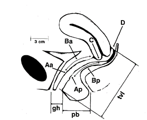

## **Atendimento da paciente no Ambulatório Primeira consulta**

Todas as pacientes com diagnóstico de **prolapso genital** são convidadas a participar do projeto de pesquisa **"Fatores de Risco, Diagnóstico, Tratamento e Prognóstico do Prolapso Genital e Incontinência Urinária Feminina"**. Caso aceitem, devem ler e assinar o Termo de Consentimento Livre e Esclarecido **(TCLE)** e os formulários da pesquisa.

Durante o atendimento, os dados da consulta e da pesquisa são inseridos na **plataforma REDCap**, através do link: [REDCap](https://redcap.lampada.uerj.br) e cadastrar no projeto **ImPOP**.

### **Formulários**

Todos os formulários abaixo devem ser preenchidos na primeira consulta:

-   Cadastro

-   Anamnese

-   Exame físico

-   Tratamento proposto

-   Questionários de autopreenchimento e TCLE (são entregues às pacientes pela recepcionista e preenchidos antes da consulta):

    -   Questionário de impacto no assoalho pélvico (PFIQ-7)

    -   Questionário de incontinência urinária (ICIQ-SF)

    -   Questionário de qualidade do sono (ISI e/ou Pittsburgh)

    -   Questionário de função sexual na mulher (FSFI-6)

Após inserir todos as informações no banco de dados, preencher o prontuário eletrônico (MV) com as informações importantes da consulta (lembrar que nem todos terão acesso ao REDCap, pois este é apenas para fins de pesquisa)

## **Prolapso dos Órgãos Pélvicos (POP)**

O POP é uma protusão, ou herniação, dos órgãos pélvicos através da vagina. Pode acometer um ou mais sítios da vagina e tecidos de sustentação. São divididos em:

-   Parede **anterior** da vagina (cistocele)
-   Parede **posterior** da vagina (retocele)
-   Compartimento **apical** (útero ou cúpula vaginal)

**Obs:** Os termos *cistocele* e *retocele* não são utilizados no nosso ambulatório, porém são encontrados em diversos textos na literatura médica.

Os defeitos dos ligamentos e da fáscia foram descritos por Delancey[@delancey1992anatomie] e divididos em três níveis, de acordo com seu acometimento:

-   **Nível 1** - suporte do terço superior da vagina e do colo uterino pelo complexo ligamentar pericervical, principalmente pelos ligamentos uterossacros.
-   **Nível 2** - suporte lateral do canal vaginal com sua inserção no arco tendíneo da fáscia pélvica (ATFP) e no arco tendíneo do músculo levantador do ânus.
-   **Nível 3** - compreende as conexões entre as membranas perineais e as fáscias do corpo perineal que sustentam o terço distal da vagina.

## **Atendimento inicial**

-   Anamnese

-   HPP

-   HGO

-   Exame físico

-   Tratamento proposto

### **Anamnese da paciente com POP**

Alguns fatores podem melhorar o prolapso, como ficar deitada, outros podem piorar, como pegar peso.

### **Fatores de risco:**

-   **Demográficos**: idade e pós-menopausa
-   **Obstétricos**: paridade, parto vaginal e fórcipe
-   **Cirurgias pélvicas**: histerectomia, cirurgias prévias para prolapso, colpossuspensão
-   **Disfunção intestinal**: Constipação crônica, dificuldades na defecação
-   **Doenças do colágeno**: Síndrome de Marfan, Ehlers-Danlos
-   **Estilo de vida**: Obesidade, tabagismo (DPOC), exercícios de alto impacto (aumento da pressão abdominal), profissional (trabalho manual com peso excessivo)
-   **Genético**: História familiar, raça branca e asiática

## **Terminologia**

Padronização de acordo com relatório conjunto da Associação Internacional de Uroginecologia (International Urogynecological Association -- IUGA) e Sociedade Internacional de Continência Iinternational Continence Society -- ICS), adotada em 2009.[@Haylen2010]

### **Sintomas Associados ao prolapso dos órgãos pélvicos**

1.  **Abaulamento vesical ("bola na vagina")**: sensação de prolapso na altura do intróito vaginal ou se exteriorizando por este, podendo ser percebido visualmente ou pela palpação da paciente;

2.  **Pressão pélvica**: aumento da sensação de peso na área suprapúbica e/ou pélvica;

3.  **Sangramento, secreção, infecção**: queixa de sangramento, secreção ou infecção relacionada à presença de ulceração no prolapso;

4.  **Apoio/digitação**: necessidade de reduzir digital ou manualmente o prolapso para auxiliar na micção; e

5.  **Dor lombar**: Associação da dor ao aparecimento do prolapso.

### **Exame físico**

Queixas de incontinência urinária de esforço - fazer o teste da tosse em com a paciente em pé e com a bexiga "confortavelmente" cheia (avaliar a perda em até três tosses);

Avaliação de pacientes com prolapso:

-   Preferencialmente deitada, porém se não for evidenciado o prolapso, deve ser feito o exame a paciente em pé.

-   Utilizar o **POP-Q**

    -   Medir primeiro: os pontos **Aa,Ba,C,Ap,Bp e D** (se aplicável) com a paciente realizando manobra de valsava

    -   A seguir, **hiato genital e corpo perineal**

    -   Por fim, reduzir o prolapso e medir o **comprimento total da vagina**.

### **POP-Q**

Os prolapsos serão classificados de acordo com o *Pelvic Organ Quantification System* (POP-Q), sistema padronizado adotado pelos membros da ICS, *American Urogynecology Society* (AUGUS) e da *Society of Gynecologic Surgeons* (SGS).[@Madhu2018; @Bump1996]

{width="403"}

### **Pontos do POP-Q**

**C:** Cérvix ou Colo; **HG:** Hiato Genital; **CP:** Corpo Perineal; **CTV:** Comprimento Vaginal Total; **D:** Fórnice vaginal posterior (ausente em mulheres histerectomizadas).

Esse sistema utiliza o anel himenal como ponto fixo de referência, sendo este o **ponto *zero****.* Toda estrutura que se encontra acima (direção cranial - proximal), recebe um valor negativo e toda estrutura abaixo (caudal - distal) recebe valores positivos.

São utilizados seis pontos de referência para realizar as medidas:

**Aa**: ponto situado na linha média da parede anterior da vagina, a 3 cm do óstio uretral. Coincide com a junção uretrovesical (colo vesical). Esse ponto pode variar de **-3 a +3**, por definição.

**Ba**: também na parede anterior da vagina, corresponde ao ponto mais distal da parede anterior da vagina. Portanto, é um ponto variável, que pode ser encontrado desde o ponto Aa até o fórnix anterior da vagina ou cúpula vaginal (quando não houver útero). Este ponto, por definição, corresponde a -3 (coincide com ponto Aa) na ausência de prolapso e coincide com o ponto C nas mulheres com prolapso completo.

**C**: corresponde ao ponto mais distal (também variável) do limite do colo uterino ou cúpula vaginal (ausência do útero).

**D**: corresponde ao ponto mais distal do fórnix posterior (fundo-de-saco de **Douglas**). Representa o ponto de inserção, no útero, dos ligamentos uterossacros. Este ponto é omitido quando a paciente não tem útero.

Obs: Esse ponto tem importância na diferenciação entre o alongamento hipertrófico do colo uterino e defeitos apicais. Pois quando há uma diferença maior do que 4 cm entre este e o ponto C, temos uma indicação de alongamento do colo uterino.

**Ap**: localizado linha média da parede posterior da vagina, análogo ao ponto Aa, situa-se a 3 cm do anel himenal. Podendo variar de -3 a +3.

**Bp**: Na parede posterior da vagina, configura-se o ponto mais distal desta, podendo variar do ponto Ap ao fórnix posterior da vagina. Por definição, na ausência de prolapso seu valor é -3.

**HG (*genital hiatus*)**: Hiato genital, medida de valor absoluto, é medido tomando-se como referência o ponto central do meato uretral estendendo-se até a porção posterior do anel himenal ou início do corpo perineal, quando aquele não pode ser identificado.

**CP (*perineal body*)**: Corpo perineal, medida também de valor absoluto, é aferido a partir do fim do hiato genital até a porção mediana do orifício anal.

**CTV (*total vaginal length*)**: comprimento total da vagina, é a medida da maior profundidade da vagina em centímetros, após a redução do prolapso.

### **Estadiamento dos prolapsos (POP-Q)**

| Estágio | Medidas do POP-Q                                                                                                      |
|:-----------:|:----------------------------------------------------------|
|  ZERO   | Ausência de prolapso                                                                                                  |
|    I    | Quando a medida está 1 cm ou mais acima do anel himenal                                                               |
|   II    | Quando a medida está entre 1 cm acima e 1 cm abaixo do anel himenal                                                   |
|   II    | Quando a medida está 1 cm abaixo do anel himenal, porém menor do que 2 cm do comprimento total da vagina (CTV -- 2cm) |
|   IV    | Quando a medida está entre 2 cm do comprimento total da vagina e a sua eversão completa (CTV ± 2cm)                   |

#### **Exemplos**

{width="552"}

{width="546"}

\newpage

### **Avaliação funcional do assoalho pélvico**

| Grau | Função                                                                  |
|:-----------:|:----------------------------------------------------------|
| ZERO | Sem função, nem mesmo à palpação                                        |
|  1   | Função objetiva ausente, reconhecida somente à palpação                 |
|  2   | Função objetiva débil, reconhecida à palpação                           |
|  3   | Função objetiva e resistência opositora, não mantida à palpação         |
|  4   | Função objetiva e resistência mantida à palpação por mais de 5 segundos |

### **Pacientes com indicação cirúrgica**

-   Solicitar exames pré-operatórios (*atualmente os exames são solicitados quando chamamos a paciente para cirurgia*)

-   Sangue e urina:

    -   Hemograma
    -   Uréia e creatinina
    -   Na+ e K+
    -   Glicemia
    -   Hb glicada para DM
    -   EAS
    -   Cultura de urina

-   Imagens

    -   Rx tórax PA e perfil
    -   US de vias urinárias (prolapsos estágio IV)
    -   Estudo urodinâmico (situações especiais)
    -   Histeroscopia (sangramento uterino anormal ou espessamento endometrial)

-   Risco cirúrgico

-   Inserir na fila de cirurgias do serviço (*Google forms*)

-   Explicar para a paciente os detalhes da cirurgia indicada e entregar o **consentimento informado** (a paciente deve levar para casa preenchido e assinado pelo médico, em duas vias, e trazer no dia da internação assinado).

    -   **Obs:** Em caso de dúvidas, pode retornar ao ambulatório ou comparecer ao setor de Ginecologia.

{width="288" height="124"}

### **Antes da internação cirúrgica**

-   Ligar para a paciente e verificar se tem exames em dia.
-   Caso não tenha, solicitar que comparece ao hospital para pegar o pedido de exames e marcar consulta pelo serviço de *Teleconsulta* do risco cirúrgico.
-   Os resultados serão enviados para o e-mail do serviço.

### **Durante a internação cirúrgica**

-   Verificar **se assinou o consentimento informado** (entregue durante a consulta do ambulatório) e anexar ao prontuário

-   Pacientes submetidas a cirurgia (preencher no [REDCap](https://redcap.lampada.uerj.br)):

    -   Formulário "Pós-operatório" (deve ser preenchido após a cirurgia e ainda durante a internação);

## **Tratamento cirúrgico para o prolapso genital**

***EM REVISÃO***

### **Revisão cirúrgica**

-   Primeira revisão entre 20 e 30 dias (casos excepcionais devem ser avaliados individualmente)

-   Verificar laudo histopatológico

-   Orientar a pegar laudo histopatológico (se aplicável) 30 dias após a cirurgia

-   Revisão da cirurgia (preencher no REDCap e MV): devem ser preenchidas em 6, 12 e 24 meses após a cirurgia todas as informações abaixo:

    -   Formulário no REDCap de Revisão da cirurgia; e

    -   Reaplicar os questionários:

        1.  de impacto no assoalho pélvico (PFIQ-7)

        2.  de incontinência urinária (ICIQ-SF)

        3.  de qualidade do sono (ISI)

        4.  de função sexual na mulher (FSFI-6)

### **Revisão clínica**

-   Reavaliar tratamento de acordo com a doença;

-   Caso seja indicada cirurgia, verificar se tem cadastro no REDCap. Caso positivo, atualizar dados; se negativo, inserir no banco como novo cadastro.

### **REFERÊNCIAS**
