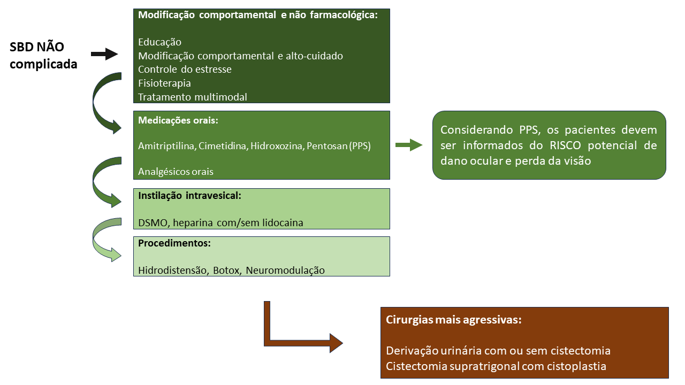

A síndrome da bexiga dolorosa (SBD) é uma doença crônica cujos sintomas duram mais de 6 semanas com exame de urina normal e cultura negativa.

**Devemos caracterizar:**

1.  Número de micções diárias

2.  Sensação de urgência miccional, geralmente causada por dor ou desconforto no enchimento vesical

3.  Localização da dor

4.  Dispareunia

5.  Disúria

6.  Resíduo miccional

7.  Exame neurológico local

Em caso de dúvidas, podemos realizar um estudo urodinâmico ou cistoscopia; esses exames não são necessários para o diagnóstico em apresentações não complicadas. Não concordância nos achados de cistoscopia ou de urodinâmica para o diagnóstico. O único achado consistente com o diagnóstico de SBD são as úlceras de Hunner, presentes em menos de 20% dos casos. Porém, as úlceras são mais frequentes em pacientes acima de 50 anos, podendo justificar a cistoscopia.

A **cistoscopia** é idealmente realizada sob anestesia geral e a maioria dos pacientes com úlcera de Hunner respondem ao tratamento.

A avalição e o tratamento seguem o algoritmo das figuras abaixo, de maneira geral.[@clemens2022diagnosis]

De uma forma geral, o tratamento clínico segue os seguintes princípios:

1.   As decisões devem ser compartilhadas com o paciente e este informado dos riscos e benefícios.

2.   Excetuando-se aqueles com úlcera de Hunner, o tatamento inicial não deve ser cirúrgico

3.   O tratamento inicial dependerá da intensidade dos sintomas

4.  Pode-se considerar tratamentos simultâneos

5.  Tratamentos ineficazes devem ser interrompidos

6.  Manejo contínuo da dor

7.   Revisar o diagnóstico em caso de ineficiência terapêutica após múltiplos tratamentos

**Medicações orais:**

**Amitrptilina** (evidência B) mostrou-se superior ao placebo, mas com alguns efeitos colaterais. Podemos começar com doses de 10 mg/dia e evoluir até 75-100 mg, se tolerado.

**Cimetidina** evidência B) também reportado com melhora importante dos sintomas, sem efeitos colaterais importantes.

**Hidroxozina** (evidência C) paciente com alergias sistêmicas parece ter uma resposta melhor. Podem apresentar sedação durante o uso no curto prazo.

**Pentosan Sulfato** (evidência B) é a única medicação aprovada pelo FDA como tratamento oral da SBD. Porém diversos estudos demonstram resultados contraditórios. O paciente deve ser AVISADO do risco potencial de dano macular e relacionados à visão.

**Ciclosporina** (evidência C) em pacientes com úlceras de Hunner refratárias à fulguração. Essas pacientes devem ser monitoradas quanto a função renal e pressão arterial.

**Instilação intravesical:**

**DMSO** [(dimetilsulfoxide); evidência C] estudos demonstram melhora dos parâmetros miccionais comparada ao placebo.

**Heparina** (evidência C), geralmente usada em associação com lidocaína alcalinizada.

**Lidocaína** (evidência B) tem demonstrado significante melhora no curto prazo. Sua alcalinização melhora a penetração no urotélio mas também aumenta a absorção sistêmica, com aumento da toxicidade potencial.

**Procedimentos**:

-   Hidrodistensão vesical (evidência C)

-   Eletrocoagulação das úlceras de Hunner (evidência C)

-   Toxina botulínica intradetrusor (evide\^ncia C), pode ser utilizada isoladamente ou em associação com a hidrodistensão

-   Neuromodulação (evidência c) não é atualmente aprovado pelo FDS como tratamento de SBD

**Cirurgias radicais:**

Cistoplastia, derivação urinária com ou sem cistoplastia (evidência C). Essas cirurgias são irreversíveis e alteram definitivamente a qualidade e estilo de vida. Deve-se exaurir todas as possibilidades viáveis e ser indicadas somente naquelas em que os sintomas são exclusivamente vesicais. Os melhores parâmetros preditores de resposta são a presença de úlceras de Hunner e a capacidade vesical reduzida sob anestesia.

**Tratamentos que não devem ser oferecidos:**

-   Antibióticos por períodos prolongados

-   Instilação de bacilo Calmette-Guerin (BCG) -- somente em estudos controlados

-   Hidrodistensão com alta pressão por período prolongado

-   Corticosteroides por longo prazo
